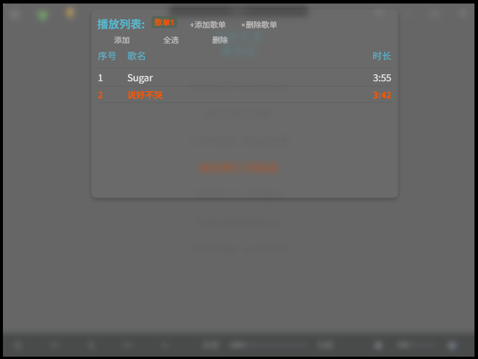

# Rust(Tauri) + JSX(React)

简单的音乐播放器，无聊玩玩

计划：
- [x] 基本播放
- [x] 多格式音频支持
- [x] 简单的视频播放
- [x] AB复读
- [x] 联网查找适配歌词
- [ ] ~~ 根据音频断句，以实现歌词自动补全，听力练习中的反复循环播放某一句（Whisper-rs?目前似乎还不成熟。是否要等待？还是嵌入python？）~~
- [ ] ~~ 插件支持主流音乐网站登录（可能支持可能不支持，看心情）~~
- [x] 修正部分音频文件因编码问题导入失败
- [x] 顶部搜索框，搜索列表中的歌曲，选中后播放
- [x] 记住桌面位置和尺寸
- [x] 桌面模式
- [ ] 部分文件导入元数据读取乱码
- [ ] 换肤(进行中)
- [ ] ~~ 格式转换~~
- [ ] 专业模式
- [ ] 动感光波
- [ ] 歌词翻译
- [ ] 放弃localstorage，改用文件存储缓存信息
- [ ] 换构架到tauri2，以支持多平台（特别是移动端）
- [ ] bug改善，特别是遇见错误时不能向上抛错

Windows 下载：[my-music_latest](https://github.com/hellolio/my_music/releases)

log：
- 换用ffmpeg，以支持更多格式
- 多歌单创建
- AB复读
- 简单的视频播放
- 记住桌面
- 换肤
- 代码整理

界面效果：

