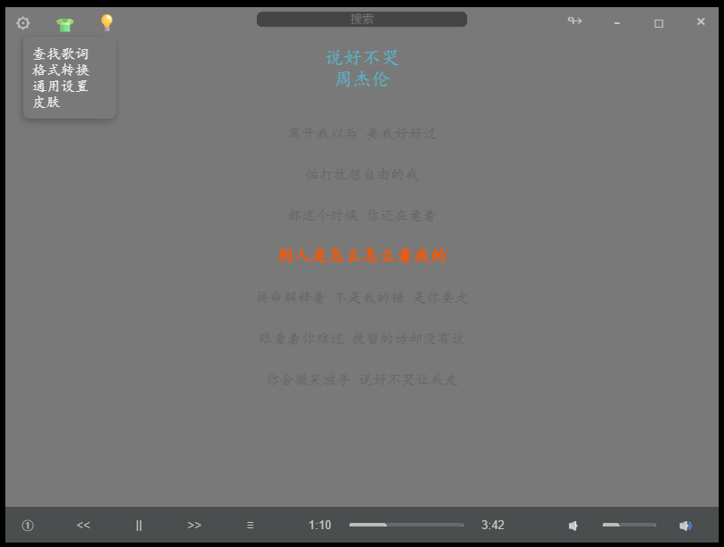
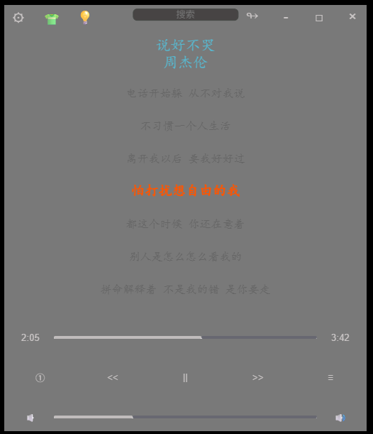
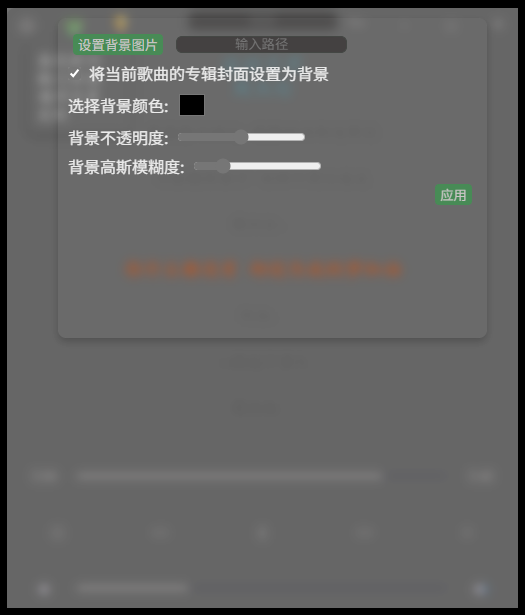
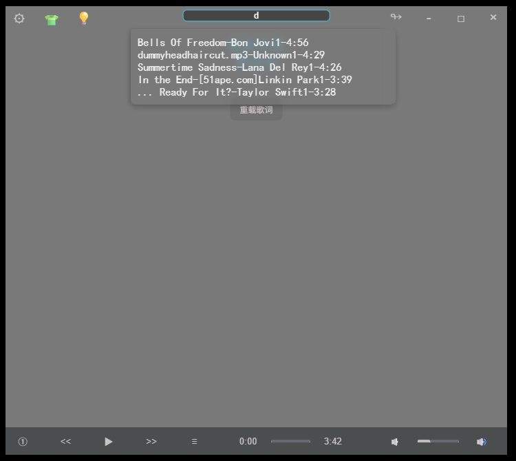

# Rust(Tauri) + JSX(React)

简单的音乐播放器，无聊玩玩

- 图标均为颜文字
- 可自定义皮肤
- 可播放部分格式视频
- 未播放时内存占用 5m

计划：

- [x] 基本播放
- [x] 多格式音频支持
- [x] 简单的视频播放
- [x] AB 复读
- [x] 联网查找适配歌词
- [x] 修正部分音频文件因编码问题导入失败
- [x] 顶部搜索框，搜索列表中的歌曲，选中后播放
- [x] 记住桌面位置和尺寸
- [x] 桌面模式
- [ ] 部分文件导入元数据读取乱码
- [x] 换肤
- [ ] 格式转换
- [ ] 专业模式
- [ ] 动感光波
- [ ] 歌词翻译
- [ ] 换构架到 tauri3，以支持多平台（特别是移动端）
- [ ] 前端切换至typescript
- [ ] bug 改善 (進行中)

bug list：

- 调整窗口大小时会崩溃
- 调整播放进度偶尔崩溃
- 切换歌曲时，壁纸会闪烁
- 初次修改壁纸后，点击应用没有反应，需要切换歌曲才行
- 第一次播放時，進度條不刷新

下载：[my-music latest](https://github.com/hellolio/my_music/releases)

界面效果：

